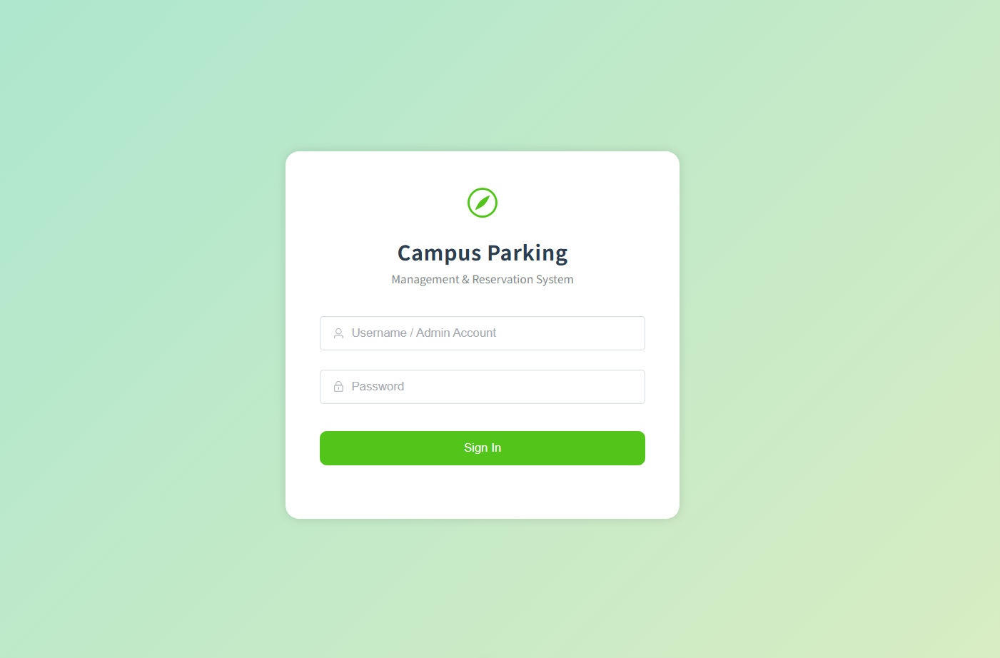
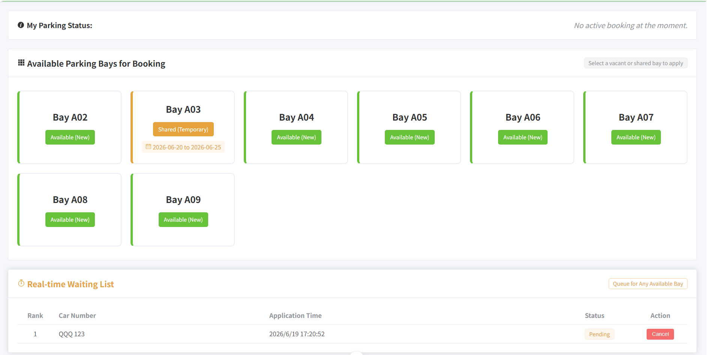
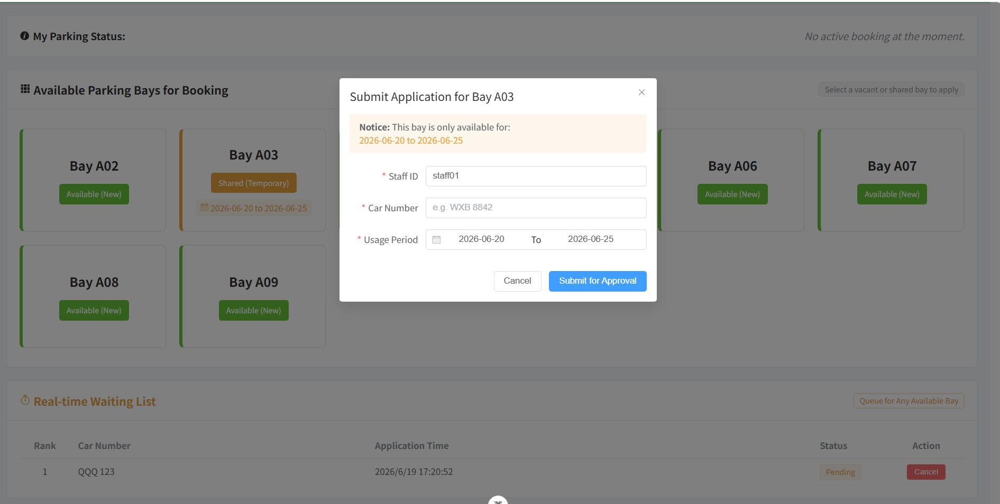
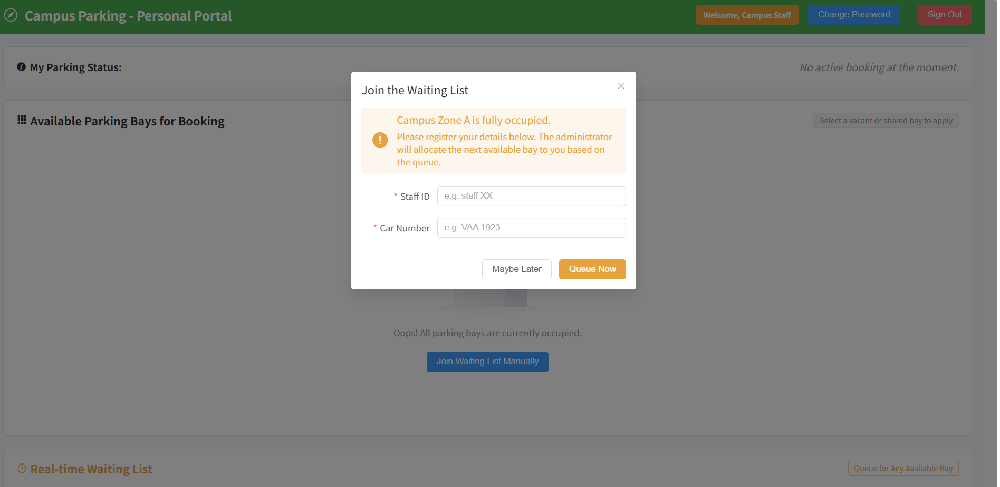
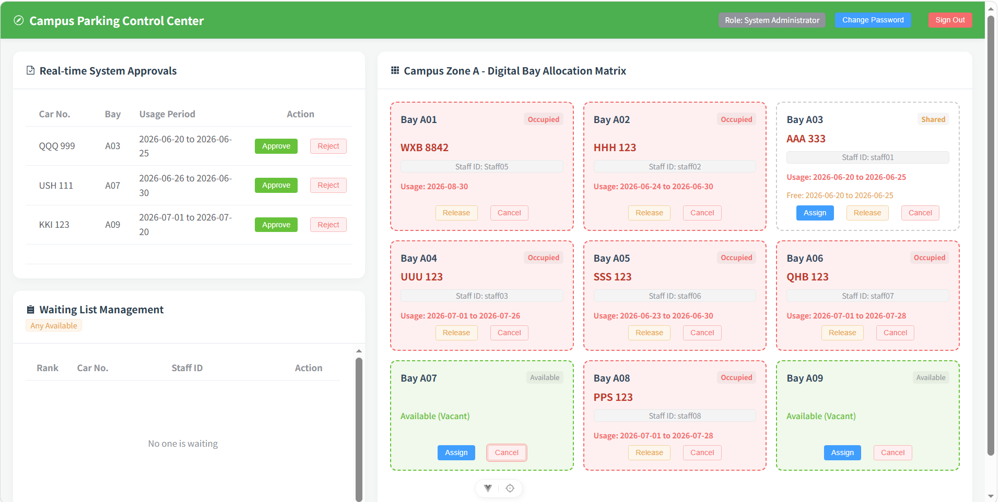

# Campus Parking Reservation System

A full-stack web application for managing monthly campus parking reservations, temporary parking-bay sharing, administrative approvals, and waiting-list allocation.

This project was developed as a master's capstone project to explore how a software-based system can improve the transparency and utilisation of limited university parking resources without requiring additional IoT hardware.

## System Preview

### Login Page



### User Dashboard



### Shared Parking-Bay Reservation



### Waiting List



### Administrator Management



## Key Features

### Staff Users

* View parking-bay availability through a visual 2D parking matrix
* Submit monthly parking reservation applications
* Temporarily share an allocated parking bay during an absence
* Apply for an available shared bay
* Join and view the parking waiting list
* Receive application and allocation status updates
* Review reservation records

### Administrators

* Review and manage parking applications
* Approve or reject monthly parking requests
* Monitor occupied, vacant, and shared parking bays
* Allocate available bays to waiting-list applicants
* Manage parking-space and application records
* View updates across browser tabs

## Technology Stack

### Backend

* Java 17
* Spring Boot 2.7.18
* MyBatis-Plus 3.5.3.1
* MySQL 8
* Maven
* BCrypt password hashing
* RESTful APIs

### Frontend

* Vue 3
* Vite
* Element Plus
* Pinia
* Axios
* Vue Router
* HTML, CSS, and JavaScript

## System Architecture

The application follows a separated frontend-backend architecture:

```text
Vue 3 Frontend
       |
       | HTTP / JSON REST APIs
       |
Spring Boot Backend
       |
       | MyBatis-Plus and JDBC
       |
MySQL Database
```

The backend processes parking applications, bay allocation, shared-bay availability, and waiting-list operations. The frontend provides separate interfaces for staff users and administrators.

## Database Structure

The MySQL database contains four principal tables:

* `sys_user` — local demonstration user accounts and roles
* `parking_bays` — parking-bay status and allocation details
* `parking_approvals` — reservation and approval records
* `waiting_list` — pending parking applicants

The repository includes a schema file containing empty parking records and BCrypt-protected demonstration accounts.

## Project Structure

```text
campus-parking-reservation-system/
├── docs/
│   └── images/
├── smart-campus-parking-backend/
│   ├── sql/
│   │   └── segi_parking_db.sql
│   ├── src/
│   └── pom.xml
├── smart-campus-parking-front/
│   ├── public/
│   ├── src/
│   ├── package.json
│   └── vite.config.js
└── README.md
```

## Prerequisites

Install the following software before running the application:

* Java 17 or later
* Maven 3.8 or later
* MySQL 8
* Node.js 20.19 or later
* npm

## Installation and Setup

### 1. Clone the Repository

```bash
git clone https://github.com/wenlinLong91/campus-parking-reservation-system.git
cd campus-parking-reservation-system
```

### 2. Create the MySQL Database

Import the database initialization script:

```bash
mysql -u root -p < smart-campus-parking-backend/sql/segi_parking_db.sql
```

Alternatively, open the SQL file in MySQL Workbench and execute it.

### 3. Configure the Database Connection

Database credentials are not stored in the repository. Set the password as an environment variable before starting the backend.

PowerShell:

```powershell
$env:DB_PASSWORD="your_local_mysql_password"
```

If necessary, configure the username and connection URL:

```powershell
$env:DB_USERNAME="root"
$env:DB_URL="jdbc:mysql://localhost:3306/segi_parking_db?useUnicode=true&characterEncoding=utf-8&useSSL=false&serverTimezone=GMT%2B8"
```

### 4. Start the Backend

```bash
cd smart-campus-parking-backend
mvn spring-boot:run
```

The backend runs at:

```text
http://localhost:8080
```

### 5. Start the Frontend

Open another terminal:

```bash
cd smart-campus-parking-front
npm install
npm run dev -- --port 5175
```

Open the displayed local URL, normally:

```text
http://localhost:5175
```

## Demonstration Accounts

The following accounts are intended only for local demonstration:

| Role          | Username     | Password        |
| ------------- | ------------ | --------------- |
| Administrator | `demo_admin` | `AdminDemo123!` |
| Staff user    | `demo_staff` | `StaffDemo123!` |

Do not use these credentials in a production environment.

## Build Verification

The source code has been verified using:

```bash
mvn clean test
```

and:

```bash
npm run build
```

Both backend and frontend builds completed successfully. The current repository does not include an automated test suite.

## Project Evaluation

The capstone evaluation documented:

* 14 manually executed functional test cases
* A 100% functional test pass rate
* User acceptance testing with eight participants
* An overall UAT mean score of 4.47 out of 5

These results relate to the evaluated academic prototype rather than a production deployment.

## Security and Privacy

The public repository has been prepared by:

* Removing local database passwords
* Using environment variables for database configuration
* Removing personal student identifiers
* Removing historical vehicle and application records
* Storing demonstration passwords as BCrypt hashes
* Restricting local cross-origin access to the frontend development address
* Excluding build outputs, dependencies, logs, and local configuration files

## Current Limitations

* The application is an academic prototype and is not production-ready.
* Cross-tab updates use browser storage events and do not provide WebSocket-based, multi-device real-time communication.
* The current version does not include JWT-based authentication.
* Role-specific interfaces are provided, but comprehensive server-side authorisation should be added before production deployment.
* Parking occupancy is managed through software records rather than physical IoT sensors.
* Automated unit and integration tests are not currently included.
* The system has been evaluated in a limited university prototype environment.

## Future Improvements

* Add JWT authentication and server-side role-based authorisation
* Implement WebSocket-based real-time updates
* Add automated unit, integration, and end-to-end tests
* Introduce email or mobile notifications
* Integrate optional IoT parking sensors
* Add reporting and parking-utilisation analytics
* Containerise the application using Docker

## Learning Outcomes

This project strengthened practical skills in full-stack development, relational database design, RESTful API development, frontend-backend integration, reservation workflow design, data validation, functional testing, and user-centred system evaluation.

## License

This project is provided for educational and portfolio purposes.
